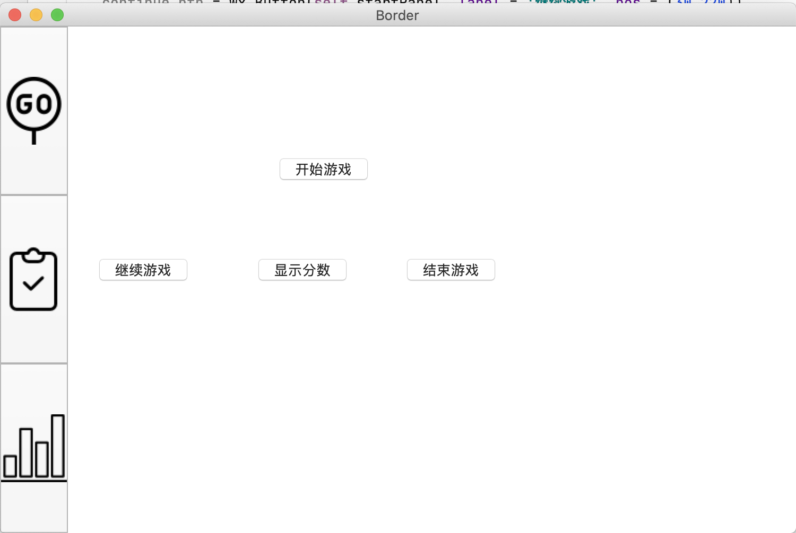
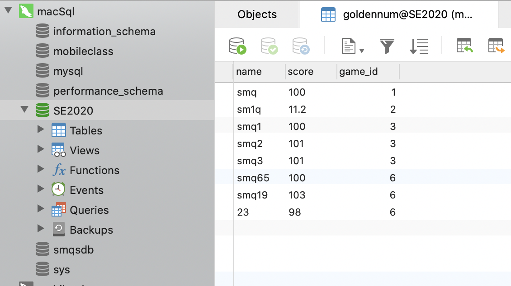

# week 11-12

[TOC]

## 工作进展

### UI界面

对界面加入了图片元素，美化了UI界面。并且可以在不同的界面之中跳转，为实现更多的丰富和复杂的功能提供了准备。



### 数据库功能

实现了保存每局游戏的信息的功能。



### 操作

实现了对键盘事件的监听，方便用户输入。

## 实现方法

### UI界面

使用wx.BitmapButton给切换界面的按钮加上图片。

然后使用三个panel对应不同的面板。

使用wx.BoxSizer实现对控件大小、位置的控制。

```python
        mainBox = wx.BoxSizer(wx.HORIZONTAL)
        mainBox.Add(sidebar)
        mainBox.Add(mainPanel, wx.ID_ANY)
        panel.SetSizer(mainBox)

        sidebarBox = wx.BoxSizer(wx.VERTICAL)
        
        startPanelButtonIcon = wx.Image('./static/img/start.png', wx.BITMAP_TYPE_PNG).ConvertToBitmap()
        self.startPanelButton = wx.BitmapButton(sidebar, wx.ID_ANY, startPanelButtonIcon)
        sidebarBox.Add(self.startPanelButton, wx.ALL)

        resultPanelButtonIcon = wx.Image('./static/img/result.png', wx.BITMAP_TYPE_PNG).ConvertToBitmap()
        self.resultPanelButton = wx.BitmapButton(sidebar, wx.ID_ANY, resultPanelButtonIcon)
        sidebarBox.Add(self.resultPanelButton, wx.ALL)

        graphPanelButtonIcon = wx.Image('./static/img/bar-chart.png', wx.BITMAP_TYPE_PNG).ConvertToBitmap()
        self.graphPanelButton = wx.BitmapButton(sidebar, wx.ID_ANY, graphPanelButtonIcon)
        sidebarBox.Add(self.graphPanelButton, wx.ALL)
        
        sidebar.SetSizer(sidebarBox)

        self.startPanel = wx.Panel(mainPanel, size = (700, 500))
        self.startPanel.SetBackgroundColour('#ffffff')
        self.resultPanel = wx.Panel(mainPanel, size = (700, 500))
        self.resultPanel.SetBackgroundColour('#ffffff')
        self.graphPanel = wx.Panel(mainPanel, size = (700, 500))
        self.graphPanel.SetBackgroundColour('#ffffff')
        self.resultPanel.Hide()
        self.graphPanel.Hide()
        
        start_btn = wx.Button(self.startPanel, label='开始游戏', pos = (200, 125))
        continue_btn = wx.Button(self.startPanel, label = '继续游戏', pos = (30,220))
        show_btn = wx.Button(self.startPanel, label = '显示分数', pos = (180,220))
        exit_btn = wx.Button(self.startPanel, label = '结束游戏', pos = (320,220))

        self.startPanelButton.Bind(wx.EVT_BUTTON, self.onStartPanelButtonClicked)
        self.resultPanelButton.Bind(wx.EVT_BUTTON, self.onresultPanelButtonClicked)
        self.graphPanelButton.Bind(wx.EVT_BUTTON, self.ongraphPanelButtonClicked)
    
    def onStartPanelButtonClicked(self, event):
        self.startPanel.Show()
        self.resultPanel.Hide()
        self.graphPanel.Hide()
    def onresultPanelButtonClicked(self, event):
        self.resultPanel.Show()
        self.startPanel.Hide()
        self.graphPanel.Hide()
    def ongraphPanelButtonClicked(self, event):
        self.graphPanel.Show()
        self.startPanel.Hide()
        self.resultPanel.Hide()
```

### 数据库保存

```python
#数据库操作示例
import pymysql
conn = pymysql.connect(host = "localhost",user = "dataUser",password = "scusmq61347",database = "SE2020",charset = "utf8")
cursor =  conn.cursor()
sql = 'select count(*) from goldennum'
cursor.execute(sql)
print(cursor.fetchone())
#####################################################
        sql_insert = 'insert into goldennum values(%s,%s,%s)'
        for i in range(self.player_num):
            player = self.player_group[i]
            args = [player.getName(),player.getScore(),self.game_id]
            self.cursor.execute(sql_insert,args)
        self.conn.commit()
        self.conn.close()
        print('exit')
```


### 键盘事件的监听

使用`wx.EVT_TEXT_ENTER`

```python
self.input_btn.Bind(wx.EVT_BUTTON or wx.EVT_TEXT_ENTER,self.onClickInputButton)
```


## 下一阶段目标

- 实现网络请求的C/S模式、前后端通信
- 实现多个玩家远程游玩


