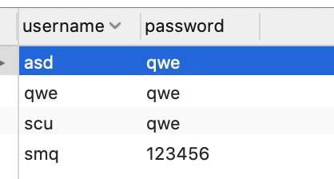
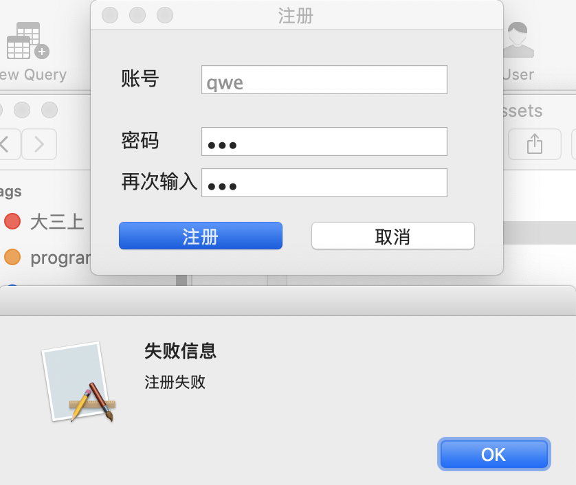
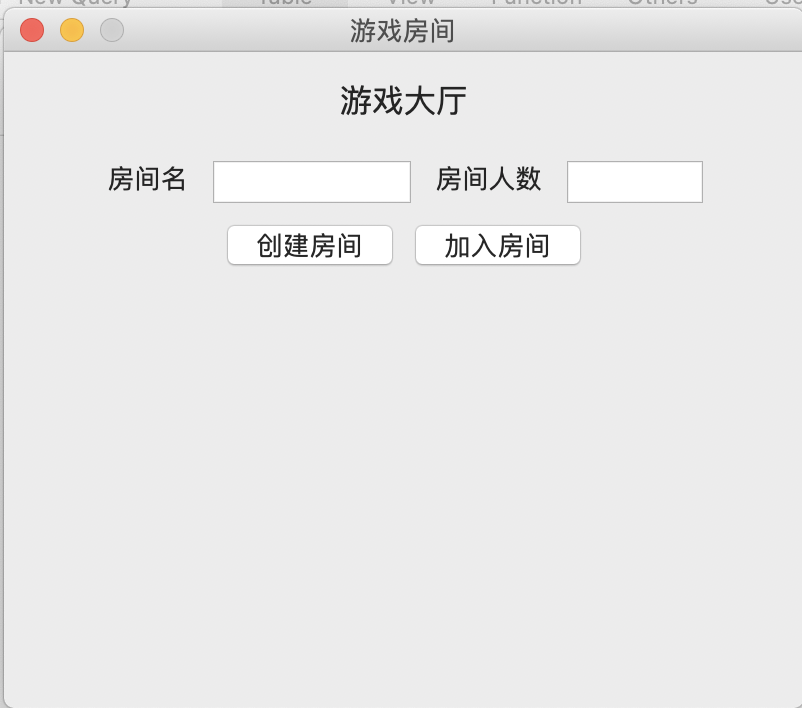
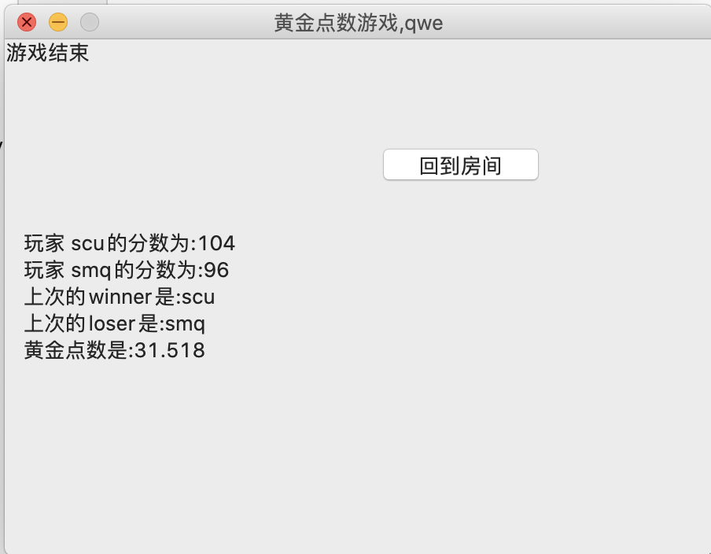

# week 13-14

[TOC]

## 工作进展

### 实现了用户登陆、注册功能






### 实现了远程游玩的功能

- 已经部署到了服务器上

- 支持创建房间，可以让多个人一起远程游玩

  

  

## 实现方法

### 服务器端:

建立socket连接，为每个socket连接建立线程来处理通信

通过房间名和用户名来标识

并且可以保存每局游戏的结果

```python
#server.py
import socket
import threading
import pymysql
from Utils import sqlUtils, sendUtils
import math
userSocket = []
roomNum = {}
roomMax = {}
sendResult = {}
Result = {}
room_Score_dict = {}
room_Input_dict = {}
roomCreator = {}
room_result = {}
room_epoch = {}
room_epochCnt = {}
room_responseCnt = {}
room_Goldenscore = {}
roomname_gameid_dict = {}
max_gameid = -1

def s_sqlInit(host = 'localhost',user = 'dataUser',password = 'scusmq61347',database = 'SE2020',charset = 'utf8'):
    global conn,cursor
    conn = pymysql.connect(host=host,user=user,password=password,database=database,charset=charset)
    cursor = conn.cursor()

def s_sqlTest():
    sql = 'select max(game_id) from goldennum'
    cursor.execute(sql)
    global max_gameid
    max_gameid = int(cursor.fetchone()[0])
    max_gameid+=1
    print('max_gameid:',max_gameid)

def s_socketInit(host = 'localhost',port = 52345):
    global sock
    sock= socket.socket()
    s_addr = (host, port)
    sock.bind(s_addr)
    sock.listen(60)

def conn_thread(soc):
    username = ''
    global roomMax,roomMax,max_gameid,room_Score_dict,room_Input_dict,room_responseCnt
    while True:
        data = soc.recv(1024)
        jsData = eval(data)
        operation = jsData['OPERATION']
        if(operation=='login'):
            args = (jsData['username'], jsData['password'])
            sql = "select count(*) from userInfo where username = '%s'and password='%s'"%args
            cursor.execute(sql)
            usernum = cursor.fetchone()[0]
            if(usernum==1):
                username = jsData['username']
                sendUtils.s_loginSuccess(soc)
            else:
                sendUtils.s_loginFailure(soc)

        if(operation=='register'):
            if(sqlUtils.uniqueUsername(conn, jsData['username'])):
                sqlUtils.insertUser(conn, jsData['username'], jsData['password'])
                sendUtils.s_registerSuccess(soc)
            else:
                sendUtils.s_registerFailure(soc)

        if(operation=='username'):
            sendUtils.s_sendUsername(soc,username)

        if(operation=='enter'):
            roomname = jsData['roomname']
            if roomname not in roomNum:
                sendUtils.s_enterFailure(soc)
            elif roomNum[roomname]>=roomMax[roomname]:
                sendUtils.s_enterFailure(soc)
            else:
                sendUtils.s_enterSuccess(soc,max_gameid,roomNum[roomname])
                playerScore = room_Score_dict[roomname]
                roomNum[roomname] += 1
                playerScore[jsData['playername']] = 100

        if(operation=='create'):
            roomname = jsData['roomname']
            maxnum = jsData['maxnum']
            room_Score_dict[roomname] = {}
            room_Input_dict[roomname] = {}
            room_responseCnt[roomname] = 0
            playerScore = room_Score_dict[roomname]
            if roomname in roomMax:
                sendUtils.s_createFailure(soc)
            else:
                roomMax[roomname] = eval(maxnum)
                roomNum[roomname] = 1
                playerScore[jsData['playername']] = 100
                room_epoch[roomname] = jsData['epoch']
                room_epochCnt[roomname] = 0
                roomCreator[roomname] = jsData['playername']
                sendUtils.s_createSuccess(soc,max_gameid)
                roomname_gameid_dict[roomname] = max_gameid
                max_gameid += 1

        if(operation=='ready'):
            roomname = jsData['roomname']
            tmpnum = roomNum[roomname]
            tmpmax = roomMax[roomname]
            if(tmpnum>=tmpmax):
                sendUtils.s_readyOK(soc)
            else:
                sendUtils.s_readyNOTOK(soc)

        if(operation=='input'):
            roomname = jsData['roomname']
            playername = jsData['playername']
            input = eval(jsData['input'])
            playerInput = room_Input_dict[roomname]
            playerInput[playername] = input

        if(operation=='result'):
            roomname = jsData['roomname']
            playername = jsData['playername']
            playerInput = room_Input_dict[roomname]
            playerscore = room_Score_dict[roomname]
            input_num = len(playerInput)
            player_num = roomMax[roomname]
            creator = roomCreator[roomname]
            far_name =''
            near_name = ''
            dis_dict = {}
            max_p = -1
            min_p = 1000
            golden_p = 0
            result_str = ''
            if creator==playername and input_num==player_num:
                print('allInput:',playerInput)
                for name,value in playerInput.items():
                    golden_p+=value
                golden_p /= player_num
                golden_p *=0.618
                for name,value in playerInput.items():
                    dis_dict[name] = math.fabs(value-golden_p)
                for name,dis in dis_dict.items():
                    if dis>max_p:
                        max_p = dis
                        far_name = name
                    if dis<min_p:
                        min_p = dis
                        near_name = name
                playerscore[near_name] += player_num
                playerscore[far_name] -= 2
                for name,score in playerscore.items():
                    result_str += '玩家 '+name+'的分数为:'+str(score)+'\n'
                result_str += '上次的winner是:' + near_name + '\n'
                result_str += '上次的loser是:' + far_name + '\n'
                result_str += '黄金点数是:' + str(golden_p) +'\n'

                room_responseCnt[roomname] = player_num
                room_result[roomname] = result_str
                room_epochCnt[roomname] += 1


            if room_responseCnt[roomname]>0:
                result_str = room_result[roomname]
                end = room_epochCnt[roomname]==room_epoch[roomname]
                ok = 'OK'
                sendUtils.s_result(soc,result_str,end,ok,room_Input_dict[roomname])
                room_responseCnt[roomname] -= 1
                if room_responseCnt[roomname]==0:
                    del room_Input_dict[roomname]
                    room_Input_dict[roomname] = {}
                if room_epochCnt[roomname]==room_epoch[roomname]:
                    sqlUtils.insertHistory(conn,playername,playerscore[playername],roomname_gameid_dict[roomname])
            else:
                sendUtils.s_result(soc,None,False,'NOTOK',None)

s_socketInit()
s_sqlInit()
s_sqlTest()

while True:
    c,addr = sock.accept()
    print('连接地址: '+str(addr))
    # Send.s_loginSuccess(c)
    userSocket.append(c)
    handle_thread =  threading.Thread(target=conn_thread,args=(c,))
    handle_thread.start()
    print('ok')

```

### 客户端：

#### client.py

作为客户端入口，提供self.updateFrame回调函数，实现面板的切换

```python
import wx
import socket
from Utils import guiManager as FrameManager

sock = socket.socket()
# host = '47.106.229.249'
host = 'localhost'
port = 52345
addr = (host,port)
sock.connect(addr)

def jsonParse(js):
    recjs = eval(js)
    if recjs['MESSAGE'] == 'SUCCESS':
        return True

data = ''

def recvMsg():
    while True:
        try:
            data = sock.recv(1024)
        except:
            continue
        else:
            jsonParse(data)
        # time.sleep(0.5)
        # print('in thread')

class clientApp(wx.App):
    def OnInit(self):
        self.manager = FrameManager.guiManager(self.updateFrame,sock)
        # self.frame = loginFrame.LoginFrame(sock)
        self.frame = self.manager.getFrame(0)
        self.SetTopWindow(self.frame)
        self.frame.Show(True)
        return True
    def OnExit(self):
        sock.close()

    def updateFrame(self, type,roomname=None,gameid=None,playername=None):
        self.frame.Show(False)
        self.frame = self.manager.getFrame(type,roomname,gameid,playername)
        self.SetTopWindow(self.frame)
        self.frame.Show(True)


if __name__ == "__main__":
    # recvThread = threading.Thread(target=recvMsg,args=())
    # recvThread.start()
    app = clientApp()
    app.MainLoop()

```

#### loginFrame.py

 实现登陆界面，用wx.Boxsizer管理控件

```python
import wx
from Utils import sendUtils
from frames import registerDialog


class LoginFrame(wx.Frame):
    def __init__(self,sock,parent=None,id=-1,updateFrame = None):
        super(LoginFrame, self).__init__(parent=None,title = '黄金点数游戏',size = (400,350))
        self.panel = wx.Panel(self,-1)
        self.sock = sock
        self.updateFrame = updateFrame

        # v_box_sizer = wx.BoxSizer(wx.VERTICAL)

        self.bt_confirm = wx.Button(self.panel, label="登陆")  # 创建按钮
        self.bt_confirm.Bind(wx.EVT_BUTTON, self.OnclickSubmit)
        self.bt_cancel = wx.Button(self.panel, label="注册")
        self.bt_cancel.Bind(wx.EVT_BUTTON, self.OnclickRegister)

        self.title = wx.StaticText(self.panel, label="登陆")

        self.label_user = wx.StaticText(self.panel, label="用户名:")
        self.text_user = wx.TextCtrl(self.panel, style=wx.TE_LEFT)

        self.label_pwd = wx.StaticText(self.panel, label="密   码:")
        self.text_password = wx.TextCtrl(self.panel, style=wx.TE_PASSWORD)
        # 控件横向排列
        hsizer_user = wx.BoxSizer(wx.HORIZONTAL)
        hsizer_user.Add(self.label_user, proportion=0, flag=wx.ALL, border=5)
        hsizer_user.Add(self.text_user, proportion=1, flag=wx.ALL, border=5)  # proportion=0表示不变,proportion=1两倍宽度

        hsizer_pwd = wx.BoxSizer(wx.HORIZONTAL)
        hsizer_pwd.Add(self.label_pwd, proportion=0, flag=wx.ALL, border=5)
        hsizer_pwd.Add(self.text_password, proportion=1, flag=wx.ALL, border=5)

        hsizer_button = wx.BoxSizer(wx.HORIZONTAL)
        hsizer_button.Add(self.bt_confirm, proportion=0, flag=wx.ALIGN_CENTER, border=5)
        hsizer_button.Add(self.bt_cancel, proportion=1, flag=wx.ALIGN_CENTER, border=5)
        # 控件纵向排列
        vsizer_all = wx.BoxSizer(wx.VERTICAL)
        vsizer_all.Add(self.title, proportion=0, flag=wx.BOTTOM | wx.TOP | wx.ALIGN_CENTER, border=15)

        vsizer_all.Add(hsizer_user, proportion=0, flag=wx.EXPAND | wx.LEFT | wx.RIGHT, border=45)
        vsizer_all.Add(hsizer_pwd, proportion=0, flag=wx.EXPAND | wx.LEFT | wx.RIGHT, border=45)
        vsizer_all.Add(hsizer_button, proportion=0, flag=wx.ALIGN_CENTER, border=15)
        self.panel.SetSizer(vsizer_all)

        font = wx.Font(16, wx.DEFAULT, wx.FONTSTYLE_NORMAL, wx.NORMAL, underline=False)
        self.title.SetFont(font)


    def validUser(self,soc):
        data = soc.recv(1024)
        jsdata = eval(data)
        print('jsdata'+str(jsdata))
        if(jsdata['MESSAGE']=='success'):
            return True
        else:
            return False
    def valiRegister(self,soc):
        data = soc.recv(1024)
        jsdata = eval(data)
        if(jsdata['MESSAGE']=='success'):
            return True
        else:
            return False

    def OnclickSubmit(self, event):
        self.username = self.text_user.GetValue()
        self.password = self.text_password.GetValue()
        sendUtils.c_sendLogInfo(self.sock, self.username, self.password)

        if(self.validUser(self.sock)):
            # self.panel.Parent.Hide()
            # app = roomFrame.MainApp()
            # app.MainLoop()
            self.updateFrame(1)
        else:
            message = '登陆失败，用户名或密码错误'
            wx.MessageBox(message,'登陆失败')

    def OnclickRegister(self, event): #注册
        dlg = RegisterWindow(self.getRegisterInfo,'#0a74f7')
        dlg.Show()

    def getRegisterInfo(self,username,password):
        self.r_username = username
        self.r_password = password
        sendUtils.c_sendRegisterInfo(self.sock, self.r_username, self.r_password)
        print('callback'+username)
        if(self.valiRegister(self.sock)):
            return
        else:
            wx.MessageBox('注册失败','失败信息')


class RegisterWindow(registerDialog.RegisterDialog):
    def __init__(self,callback_func,themeColor):
        registerDialog.RegisterDialog.__init__(self, '注册', callback_func, themeColor)

```

### registerDialog.py 

实现注册，往数据库中写入数据，并且支持注册检测

```python
import wx


class RegisterDialog(wx.Dialog):
    def __init__(self, title, func_callBack, themeColor):
        wx.Dialog.__init__(self, None, -1, title, size=(300, 200))
        self.func_callBack = func_callBack
        self.themeColor = themeColor

        self.InitUI()  # 绘制Dialog的界面

    def InitUI(self):
        panel = wx.Panel(self)

        font = wx.Font(14, wx.DEFAULT, wx.BOLD, wx.NORMAL, True)

        accountLabel = wx.StaticText(panel, -1, '账号', pos=(20, 25))
        accountLabel.SetFont(font)

        self.accountInput = wx.TextCtrl(panel, -1, u'', pos=(80, 25), size=(180, -1))
        self.accountInput.SetForegroundColour('gray')
        self.accountInput.SetFont(font)

        passwordLabel1 = wx.StaticText(panel, -1, '密码', pos=(20, 70))
        passwordLabel1.SetFont(font)
        self.passwordInput1 = wx.TextCtrl(panel, -1, u'', pos=(80, 70), size=(180, -1), style=wx.TE_PASSWORD)
        self.passwordInput1.SetFont(font)

        passwordLabel2 = wx.StaticText(panel, -1, '再次输入', pos=(20, 100))
        passwordLabel2.SetFont(font)
        self.passwordInput2 = wx.TextCtrl(panel, -1, u'', pos=(80, 100), size=(180, -1), style=wx.TE_PASSWORD)
        self.passwordInput2.SetFont(font)

        sureButton = wx.Button(panel, -1, u'注册', pos=(20, 130), size=(120, 40))
        self.Bind(wx.EVT_BUTTON, self.sureEvent, sureButton)

        cancleButton = wx.Button(panel, -1, u'取消', pos=(160, 130), size=(120, 40))

        # 为【取消Button】绑定事件
        self.Bind(wx.EVT_BUTTON, self.cancleEvent, cancleButton)

    def sureEvent(self, event):
        account = self.accountInput.GetValue()
        password1 = self.passwordInput1.GetValue()
        password2 = self.passwordInput2.GetValue()
        if password1!=password2:
            wx.MessageBox('两次输入的密码不一致','注册失败')
            return
        # 通过回调函数传递数值
        self.func_callBack(account, password1)
        self.Destroy()  # 销毁隐藏Dialog

    def cancleEvent(self, event):
        self.Destroy()  # 销毁隐藏Dialog
```

#### roomFrame.py 

通过房间名创建、加入房间

```python
import wx
from Utils import sendUtils


class RoomFrame(wx.Frame):
    def __init__(self, sock,parent=None,id=-1,updateFrame = None):
        wx.Frame.__init__(self, parent, -1, title="游戏房间", size=(400, 350),
                          style=wx.DEFAULT_FRAME_STYLE & ~(wx.RESIZE_BORDER | wx.MAXIMIZE_BOX))
        self.panel = wx.Panel(self,-1)
        self.sock = sock
        self.updateFrame = updateFrame
        self.username = self.getUsername(self.sock)
        self.gameid = 0


        print('self.username:',self.username)
        self.initUI()

    def initUI(self):
        self.bt_create = wx.Button(self.panel,label="创建房间")
        self.bt_create.Bind(wx.EVT_BUTTON, self.OnclickCreate)
        self.bt_enter = wx.Button(self.panel,label="加入房间")
        self.bt_enter.Bind(wx.EVT_BUTTON,self.OnclickEnter)
        hsizer_control = wx.BoxSizer(wx.HORIZONTAL)
        hsizer_control.Add(self.bt_create,proportion=0,flag=wx.ALL,border=5)
        hsizer_control.Add(self.bt_enter,proportion=0,flag=wx.ALL,border=5)

        self.label_name = wx.StaticText(self.panel,label="房间名")
        self.text_name = wx.TextCtrl(self.panel,style=wx.TE_LEFT)
        self.label_num = wx.StaticText(self.panel,label="房间人数")
        self.text_num = wx.TextCtrl(self.panel,style=wx.TE_LEFT)
        hsizer_input = wx.BoxSizer(wx.HORIZONTAL)
        hsizer_input.Add(self.label_name,proportion=0,flag=wx.ALL,border=5)
        hsizer_input.Add(self.text_name, proportion=1, flag=wx.ALL, border=5)
        hsizer_input.Add(self.label_num, proportion=0, flag=wx.ALL, border=5)
        hsizer_input.Add(self.text_num, proportion=1, flag=wx.ALL, border=5)

        self.title = wx.StaticText(self.panel, label="游戏大厅")
        font = wx.Font(16, wx.DEFAULT, wx.FONTSTYLE_NORMAL, wx.NORMAL, underline=False)
        self.title.SetFont(font)
        vsizer_all = wx.BoxSizer(wx.VERTICAL)
        vsizer_all.Add(self.title, proportion=0, flag=wx.BOTTOM | wx.TOP | wx.ALIGN_CENTER, border=15)
        vsizer_all.Add(hsizer_input, proportion=0, flag=wx.EXPAND | wx.LEFT | wx.RIGHT, border=45)
        vsizer_all.Add(hsizer_control, proportion=0, flag=wx.ALIGN_CENTER, border=15)
        self.panel.SetSizer(vsizer_all)

    def OnclickCreate(self,event):
        roomname = self.text_name.GetValue()
        maxnum = self.text_num.GetValue()
        sendUtils.c_createRoom(self.sock,roomname,maxnum,self.username)
        if self.validCreate(self.sock):
            self.updateFrame(2,roomname,self.gameid,self.username)  #playerid == 0
        else:
            wx.MessageBox('创建房间失败，请更换房间名','创建失败')
    def OnclickEnter(self,event):
        roomname = self.text_name.GetValue()
        sendUtils.c_enterRoom(self.sock,roomname,self.username)
        if self.validEnter(self.sock):
            self.updateFrame(2,roomname,self.gameid,self.username)
        else:
            wx.MessageBox('加入房间失败（房间不存在或人数已满）','加入失败')

    def validCreate(self,soc):
        data = soc.recv(1024)
        jsdata = eval(data)
        if(jsdata['MESSAGE']=='success'):
            self.gameid = jsdata['gameid']
            return True
        else:
            return False

    def validEnter(self,soc):
        data = soc.recv(1024)
        jsdata = eval(data)
        if(jsdata['MESSAGE']=='success'):
            self.gameid = jsdata['gameid']
            self.playerid = jsdata['playerid']
            return True
        else:
            return False

    def getUsername(self,soc):
        sendUtils.c_getUsername(soc)
        data = soc.recv(1024)
        jsdata = eval(data)
        return jsdata['MESSAGE']

class MainApp(wx.App):
    def OnInit(self):
        self.frame = RoomFrame(None)
        self.frame.Show()
        return True

if __name__ == "__main__":
    app = MainApp()
    app.MainLoop()

```

#### gameFrame.py

通过线程来等待其他玩家的输入和最终的结果

```python
import wx
import math
import pymysql
import threading
from Utils import sendUtils
import time
from threading import Timer
class GameFrame(wx.Frame):
    def __init__(self,sock,roomname=None,gameid=None,playername=None,parent=None,id=-1,updateFrame=None):
        wx.Frame.__init__(self,parent=None, title='黄金点数游戏,'+roomname,size = (450,350),style=wx.DEFAULT_FRAME_STYLE & ~(wx.RESIZE_BORDER | wx.MAXIMIZE_BOX))


        self.sock = sock
        self.updateFrame = updateFrame
        self.gameid = gameid
        self.playername = playername
        print('game creator:',self.playername)
        self.roomname = roomname
        print('playerid:',playername)
        waiting_thread = threading.Thread(target=self.waiting,args=(self.sock,))
        waiting_thread.start()

        self.initWidgets()
        self.bindEvents()

        self.Show()

    def initWidgets(self):
        self.panel = wx.Panel(self)
        self.label_waiting = wx.StaticText(self.panel,-1,label = '请等待其他玩家加入',pos=(10,70))
        self.label_waitothers = wx.StaticText(self.panel, -1, label='请等待其他玩家输入', pos=(10, 70))
        self.label_waitothers.Hide()

        self.label_input = wx.StaticText(self.panel,-1,label = '请输入您的点数',pos=(10,70))
        self.text_input = wx.TextCtrl(self.panel,-1,value='',pos=(120,70))
        self.bt_input = wx.Button(self.panel,label='确定',pos = (240,70),size=(60,20))
        self.hideInput()

        self.text_result = wx.StaticText(self.panel,-1,label='',pos=(10,120))
        self.text_wait = wx.StaticText(self.panel,-1,label='五秒后回到输入')
        self.hideResult()

        self.bt_return = wx.Button(self.panel,label='回到房间',pos = (240,70),size=(100,20))
        self.bt_return.Bind(wx.EVT_BUTTON,self.OnclickReturn)
        self.bt_return.Hide()

    def OnclickInput(self,event):
        point = self.text_input.GetValue()
        sendUtils.c_point(self.sock,point,self.playername,self.roomname)
        self.hideInput()
        self.label_waitothers.Show()
        result_thread = threading.Thread(target=self.getResult,args=(self.sock,))
        result_thread.start()

    def OnclickReturn(self,event):
        self.updateFrame(1)
    def bindEvents(self):
        self.bt_input.Bind(wx.EVT_BUTTON,self.OnclickInput)

    def showResult(self):
        self.text_result.Show()
        self.text_wait.Show()
    def hideResult(self):
        self.text_result.Hide()
        self.text_wait.Hide()

    def showInput(self):
        self.label_input.Show()
        self.text_input.Show()
        self.bt_input.Show()

    def hideInput(self):
        self.label_input.Hide()
        self.text_input.Hide()
        self.bt_input.Hide()

    def initData(self):
        self.player_num = 0
        self.golden_score = 0
        self.player_group = []
        self.player_input = []
        self.tmpId = 0
        self.maxId = -1
        self.minId = -1
        # self.player_group.append(Player(str(0)))
        self.conn = pymysql.connect(
            host = "localhost",
            user = "dataUser",
            password = "scusmq61347",
            database = "SE2020",
            charset = "utf8"
        )
        sql_count = 'select count(*) from goldennum'
        self.cursor = self.conn.cursor()
        self.cursor.execute(sql_count)
        self.game_id = self.cursor.fetchone()[0]+1
        self.firstGame = True

    def waiting(self,soc):
        while True:
            time.sleep(0.05)
            sendUtils.c_readyQuery(soc,self.roomname)
            data = soc.recv(1024)
            jsdata = eval(data)
            if(jsdata['MESSAGE']=='OK'):
                self.ready = True
                print('ready ok')
                self.label_waiting.Hide()
                self.showInput()
                return

    def showInputAgain(self):
        self.showInput()
        self.hideResult()

    def getResult(self,soc):
        while True:
            time.sleep(0.05)
            sendUtils.c_resultQuery(soc,self.playername,self.roomname)
            data = soc.recv(1024)
            jsdata = eval(data)
            if(jsdata['MESSAGE']=='OK'):
                self.label_waitothers.Hide()
                self.showResult()
                self.text_result.SetLabel(jsdata['result'])
                self.all_input = jsdata['all_input']
                print(self.all_input)
                end = jsdata['end']
                if not end:
                    t = Timer(5.0,self.showInputAgain)
                    t.start()
                else:
                    self.bt_return.Show()
                    self.text_wait.SetLabel('游戏结束')
                return

if __name__ == '__main__':
    app = wx.App()
    frame = GameFrame(None)
    app.MainLoop()

```

